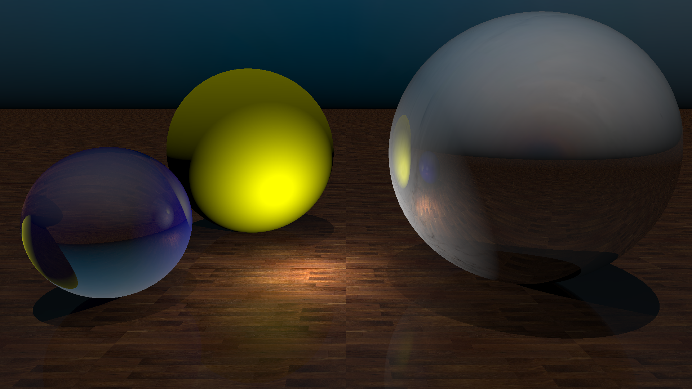

## Raytracing tutorial for basic rust

Made a raytracer in rust! cool!



```
cargo run --example balls --release
```


Many thanks to bheisler whos blog + code I followed:

code:

https://github.com/bheisler/raytracer

blogposts:

https://bheisler.github.io/post/writing-raytracer-in-rust-part-1/
https://bheisler.github.io/post/writing-raytracer-in-rust-part-2/
https://bheisler.github.io/post/writing-raytracer-in-rust-part-3/